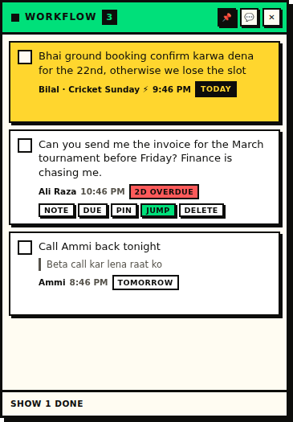
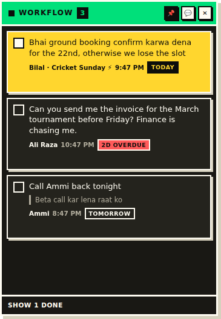

# Workflow

Turn WhatsApp messages into desktop sticky notes.

Someone messages you asking for something. You read it, you mean to do it, and
it scrolls away forever. Workflow puts a 📌 on every WhatsApp message — one
click and it becomes a task on a small always-on-top note that stays in the
corner of your screen until you tick it off.

| Light | Dark |
| :---: | :---: |
|  |  |

---

## Why it's a whole WhatsApp client

This is the part worth understanding before you install it.

The official **WhatsApp Desktop app is closed software**. Nothing can add a
button to it — not a plugin, not a script, not a browser extension. And a
browser extension is doubly out: extensions can't create always-on-top windows,
so a "sticky note" made that way vanishes the moment you switch to another app.

So Workflow *is* the WhatsApp window. It loads WhatsApp Web inside itself,
injects the pin button, and runs the sticky board as a real frameless OS window
that floats above everything else.

**What that means for you:**

- You run Workflow instead of the official WhatsApp Desktop app.
- One-time QR scan to link it (Settings → Linked devices on your phone).
  WhatsApp allows 4 linked devices, so your phone and other machines are fine.
- Your phone stays the primary device. Nothing changes there.

---

## Install

```bash
git clone https://github.com/syedsibtainhaidergardezi-png/Workflow.git
cd Workflow
npm install
npm start
```

Two windows open: WhatsApp Web (scan the QR the first time) and the sticky
board. Your login persists between runs.

That's **dev mode** — it runs from source and needs a terminal. For everyday
use you want a real installed app.

---

## Installing it properly

```bash
npm run dist
```

This writes an installer to `release/`:

| OS | Artifact | Installer | Installed |
| --- | --- | --- | --- |
| Windows | `Workflow-Setup-0.1.0.exe` | ~100 MB | ~260 MB |
| macOS | `Workflow-0.1.0.dmg` | ~100 MB | ~260 MB |
| Linux | `Workflow-0.1.0.AppImage` | 103 MB | — (single file) |

Run it and you get a normal application: Start Menu / Applications entry, its
own icon, pinnable to the taskbar or dock, no terminal and no Node needed. The
installer is a guided one, so **you can point it at another drive** if your
system drive is tight.

**Windows will show a SmartScreen warning** ("Windows protected your PC") the
first time. That's expected — the build is unsigned, and silencing it requires
a paid code-signing certificate. Click *More info → Run anyway*.

### Updating it

There's no auto-update. To ship yourself a new version:

```bash
git pull                       # or just edit the code
npm version patch              # 0.1.0 -> 0.1.1
npm run dist
```

Then run the new installer. It upgrades in place over the old version — your
tasks and your WhatsApp login are untouched, because both live in the user data
directory rather than the install directory.

**Keep the install path the same each time** and your taskbar pin keeps
working; the installer remembers the previous location and pre-fills it. Point
it somewhere new and you'll need to re-pin.

If you later want real auto-update, that's `electron-updater` plus a release
feed. Worth knowing up front: with a **private** repo, the GitHub feed needs a
token embedded in the shipped app, so the usual answers are to make the repo
public, publish releases from a separate public repo, or host the feed
yourself.

### Regenerating the icon

The icon is generated from code — there are no binary source assets:

```bash
npm run icons          # rewrites build/icon.ico and build/icon.png
```

Edit the design in `scripts/make-icons.mjs`. It also prints the base64 string
for the tray icon in `src/main/icon.ts`.

---

## Using it

**Capture** — hover any message, click the 📌 that appears beside the bubble.

If a redesign ever breaks the pin buttons, **select any text, right-click →
"Save selection to Workflow"** always works. It doesn't depend on WhatsApp's
markup at all.

**On the board**

| Action | How |
| --- | --- |
| Jump back to the original message | Click the task text, or `Jump` |
| Write what actually needs doing | `Note` — the note replaces the message as the headline, message stays as a quote |
| Set a reminder | `Due` → Today / Tomorrow / Next week / pick a date |
| Keep something at the top | `Pin` |
| Done | The checkbox |
| Show/hide the board | `Ctrl+Shift+W`, the tray icon, or `✕` |

Overdue tasks turn red, tasks due today turn amber. Sorting is pinned first,
then soonest due, then most recently captured. Completed tasks stay visible
under "Show N done" and are swept after 7 days.

Drag the board by its title bar. Position, size and always-on-top state are
remembered.

---

## Your data

Everything is local. There is no server, no account, no telemetry, and the app
makes no network requests of its own — only WhatsApp Web does, to WhatsApp.

Tasks live in a plain JSON file:

| OS | Path |
| --- | --- |
| Windows | `%APPDATA%\Workflow\tasks.json` |
| macOS | `~/Library/Application Support/Workflow/tasks.json` |
| Linux | `~/.config/Workflow/tasks.json` |

Back it up or edit it by hand; it's just an array of task objects.

---

## How it's put together

```
src/
├── main/            Electron main process
│   ├── main.ts        lifecycle, single-instance lock, global shortcut
│   ├── windows.ts     the WhatsApp window + the always-on-top sticky window
│   ├── store.ts       JSON persistence, sorting, dedupe, sweeping
│   ├── ipc.ts         channel handlers
│   └── tray.ts        tray icon + open-task count
├── preload/
│   ├── whatsapp.ts    ← injected into WhatsApp Web: pin buttons, scraping, jump-to-message
│   └── sticky.ts      contextBridge API for the board
├── renderer/sticky/   the board UI (no framework, ~350 lines)
└── shared/types.ts    types + IPC channel names
```

Security posture: `contextIsolation` on, `nodeIntegration` off, the board runs
under a strict CSP, and message text — which comes from other people — only
ever reaches the DOM via `textContent`, never `innerHTML`.

---

## Known limits

**WhatsApp's markup is not a public API.** `src/preload/whatsapp.ts` reads
WhatsApp Web's DOM, and WhatsApp rotates its class names freely. Selectors are
written defensively with fallbacks, and are pinned to structural attributes
(`data-id`, `data-pre-plain-text`) that have been stable for years — but a big
redesign could still break the pin buttons. The right-click capture path is the
fallback that can't break, and the selectors are all in one file, near the top,
with comments.

**"Jump" is best effort.** WhatsApp Web has no jump-to-message-ID feature and
virtualises old messages out of the DOM. Workflow opens the right chat and
scrolls to the message when it's loaded; when it isn't, it opens the chat and
tells you to scroll. The task text on the board is always the full record.

**Unofficial client.** This wraps WhatsApp Web rather than using an official
API, because none exists for this. It only reads the page and never sends,
automates or bulk-anything — but it is not endorsed by WhatsApp, and you should
know that before linking your account.

---

## License

MIT
